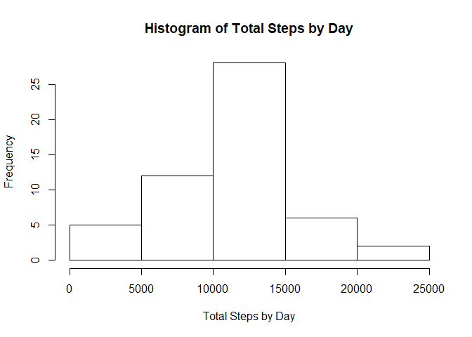

# Reproducible Research: Peer Assessment 1


## Loading and preprocessing the data


```r
require(dplyr, warn.conflicts = FALSE, quietly = TRUE)
require(lattice, quietly = TRUE)
options(scipen = 999) ##Keep from scientific notation

rawdata <- read.csv("activity.csv")
rawdata <- tbl_df(rawdata)
rawdata.nona <- filter(rawdata,!is.na(steps))
```

## What is mean total number of steps taken per day?


```r
day.steps <- select(rawdata.nona,steps,date,interval) %>% group_by(date) %>% summarize(Total.Steps=sum(steps))

myMean<-as.integer(mean(day.steps$Total.Steps))
myMedian <- as.integer(median(day.steps$Total.Steps))

hist(day.steps$Total.Steps, main="Histogram of Total Steps by Day", xlab = "Total Steps by Day")
```

<!-- -->
  
The **MEAN** number of steps taken per day is: 10766  
The  **MEDIAN** number of steps taken per day is: 10765


## What is the average daily activity pattern?

```r
averageSteps <- select(rawdata.nona,steps,date,interval) %>% group_by(interval) %>% summarize(Mean.Steps=mean(steps))
highestInterval <- arrange(averageSteps,desc(Mean.Steps))[1,1]
plot(averageSteps, type="l", main="Average Daily Activity Pattern", xlab="5 Minute Intervals", ylab="Mean Steps")
```

<!-- -->
  
The 5-minute interval with the highest average is: 835


## Imputing missing values  
Since the data set is missing certain values, the missing values were imputed to the data set.  To determine which values to impute, the interger value of the average steps for each time interval was added as the missing value.

```r
numberNA <- nrow(filter(rawdata,is.na(steps)))
onlyNA <- filter(rawdata,is.na(steps))
tempDF <- rawdata.nona %>% select(interval,steps) %>% group_by(interval) %>% summarise(avg.steps=mean(steps))
onlyNA <- merge(onlyNA,tempDF,all.x = TRUE,by.x = "interval", by.y="interval")
onlyNA <- mutate(onlyNA,steps=as.integer(avg.steps))
onlyNA<-select(onlyNA,-avg.steps)
onlyNA<-tbl_df(onlyNA)
rawdata.new <- rbind(rawdata.nona,onlyNA)

day.steps <- select(rawdata.new,steps,date,interval) %>% group_by(date) %>% summarize(Total.Steps=sum(steps))

myMean.imputed <-as.integer(mean(day.steps$Total.Steps))
myMedian.imputed <- as.integer(median(day.steps$Total.Steps))

hist(day.steps$Total.Steps, main="Histogram of Total Steps by Day (With Imputed Data)", xlab = "Total Steps by Day")
```

<!-- -->
  
The **MEAN** number of steps taken per day (with imputed data) is: 10749  
The  **MEDIAN** number of steps taken per day (with imputed data) is: 10641
  
Comparison to Original Values  

Variable    |Original value   | Imputed Value         | Difference
------------|-----------------| --------------------- |------------
MEAN        |10766       | 10749    | -17
MEDIAN      |10765     | 10641  | -124


## Are there differences in activity patterns between weekdays and weekends?


```r
data.addDays <- mutate(rawdata.new,Day = case_when(weekdays(as.Date(date))=="Saturday"~"Weekend", weekdays(as.Date(date))=="Sunday"~"Weekend", TRUE~"Weekday" ))

data.WeekDay <- data.addDays %>% filter(Day=="Weekday") %>% group_by(interval) %>% summarize(Avg.Steps=mean(steps))

data.WeekEnd <- data.addDays %>% filter(Day=="Weekend") %>% group_by(interval) %>% summarize(Avg.Steps=mean(steps))

data.allDays <- data.addDays %>% group_by(Day,interval) %>% summarize(Avg.Steps=mean(steps))
xyplot(Avg.Steps~interval|Day,data=data.allDays, type="l", layout=c(1,2), ylab = "Average Number of Steps")
```

<!-- -->


